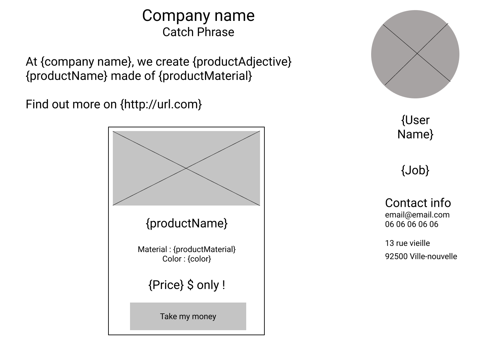

# fake-profile

Créez un faux profil d'utilisateur qui travaille pour une fausse compagnie qui crée un faux produit, à l'aider de [Faker](http://marak.github.io/faker.js/) !

Vous devez créer une API qui vous permets de géner les données de la page. La page est servie statiquement par votre serveur. Toutes les données doivent etre bidon  et regénérées à chaque refresh !

Pour plus d'informations, venez me poser des questions !

